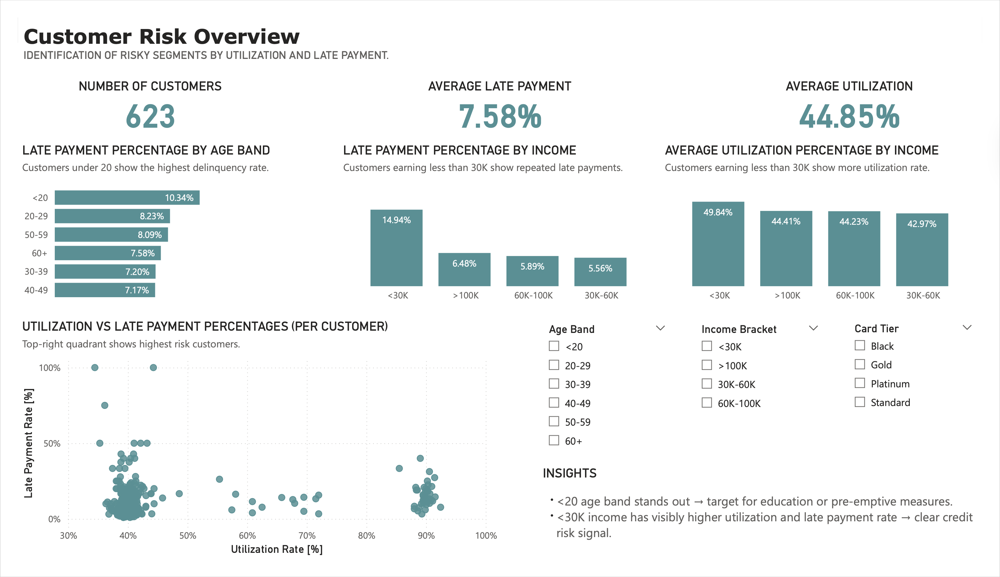

# Credit Card Risk Analysis

---

## 🔍 Overview

This project analyzes the behavior of credit card customers. The goal was to identify high-risk customer segments, detect early signs of financial distress, and provide actionable recommendations to reduce credit exposure.

Built using the **ELT** approach:
* **Extract** from CSV → **Load** into PostgreSQL → **Transform** with SQL → **Visualize** with Power BI.

## 📊 Key Insights

* Customers under 20 and those earning less than 30K show higher late payment rates and utilization.
* High-tier card holders (e.g., Black) tend to be more financially stable.
* Late payment behavior has been steady since 2019 (~7–9% annually).
* Some new or low-spending customers exhibit repeated delinquency and may require credit limit adjustments.

## 🎯 Dashboard Overview

## 🧰 Tools

* **PostgreSQL** - Data loading, validation, profiling, and transformation (SQL)
* **SQL** - Used for joins, aggregations, data quality checks, and view creation
* **Power BI** - Data visualization and dashboard development

## 🗂️ Project Structure

<pre lang="text">
├── data/                          # Raw CSV datasets
│   ├── customers.csv
│   ├── credit_cards.csv
│   ├── payment_behavior.csv
│   └── transactions.csv
│
├── sql/                           # SQL scripts
│   ├── sql_data_validation_and_profiling.sql
│   └── sql_data_exploration.sql
│
├── docs/                          # Documentation
│   ├── data_dictionary.xlsx
│   ├── SQL_Data_Validation_Profiling_Report.pdf
│   └── SQL_Data_Exploration_Report.pdf
│
├── Power_BI_Data_Analysis.pdf     # Final Power BI dashboard
└── README.md
</pre>

## 📈 Dashboard Pages

📎 [View Full Dashboard (PDF)](./Power_BI_Data_Analysis.pdf)

1. **Customer Risk Overview** – High-risk segments by age, income, and card tier
2. **Early Signs of Credit Distress** – Trends in utilization and payment behavior
3. **Demographic Breakdown** – Risk metrics across demographic groups
4. **Exposure Reduction** – Tables flagging customers for monitoring or action

## 📂 Files
* **Power_BI_Data_Analysis.pdf** – Final dashboard export (multi-page report)
* **sql_data_validation_and_profiling.sql** – SQL script generated during the data validation and profiling phase
* **sql_data_exploration.sql** – SQL script generated during the data exploration phase
* **SQL_Data_Validation_Profiling_Report.pdf** – Report summarizing the SQL data validation and profiling phase
* **SQL_Data_Exploration_Report.pdf** – Report summarizing the data exploration phase
* **data_dictionary.xlsx** – Document that describes the content and structure of the datasets

## 🧪 Dataset

Fictional dataset created for portfolio purposes. Includes anonymized information on:
* Customers
* Credit cards
* Transactions
* Payment behavior

---

💡 This project is part of my portfolio. Feedback is welcome!

**Tags:** SQL, Power BI, ELT, Credit Risk, Portfolio Project, Data Profiling, Dashboard, PostgreSQL
